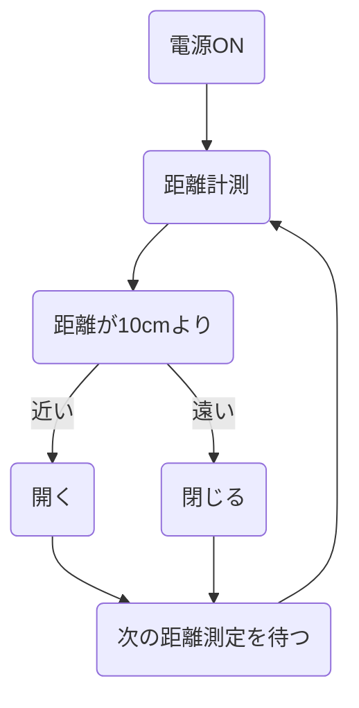
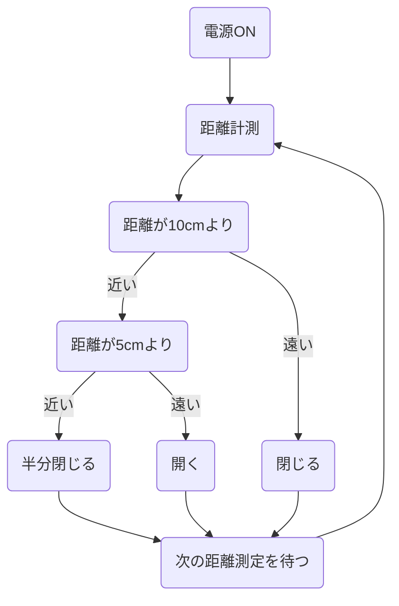

# PG例

```mermaid
graph TD
    A(電源ON)-->B(距離計測)
    B-->C(距離が10cmより)
    C-->|近い|D(開く)
    C-->|遠い|E(閉じる)
    D-->F(次の距離測定を待つ)
    E-->F
    F-->B
```

---

```mermaid
graph TD
    A(電源ON)-->B(距離計測)
    B-->C(距離が10cmより)
    C-->|近い|D(距離が5cmより)
    D-->|近い|DA(半分閉じる)
    D-->|遠い|DB(開く)
    C-->|遠い|E(閉じる)
    DA-->F(次の距離測定を待つ)
    DB-->F
    E-->F
    F-->B
```

