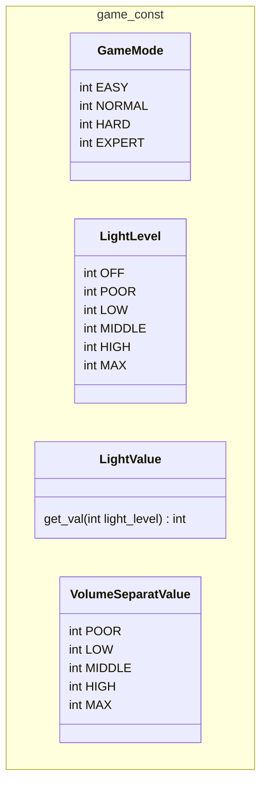
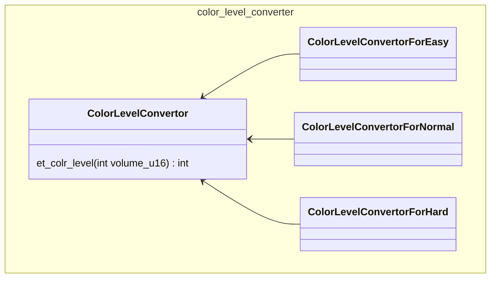
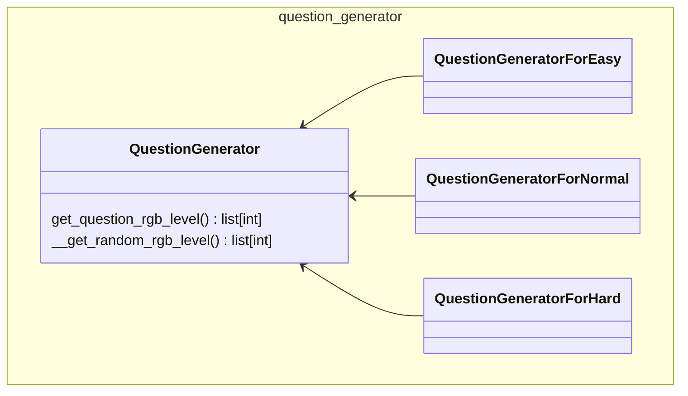
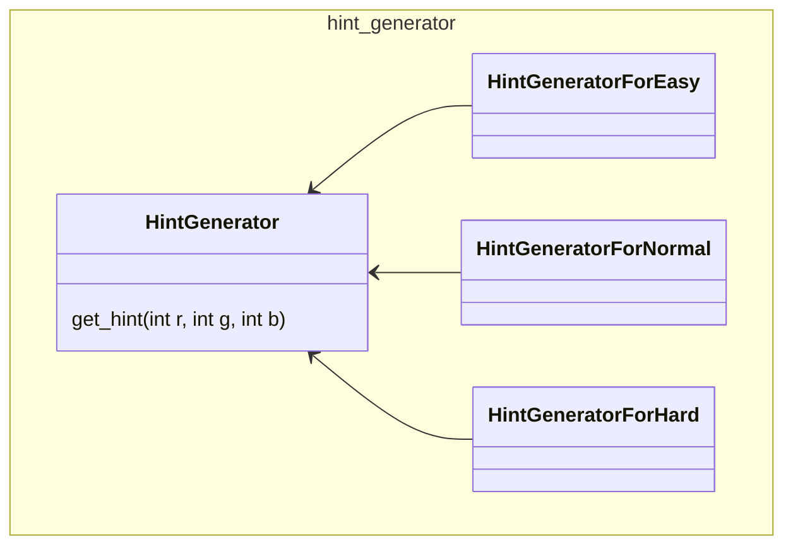
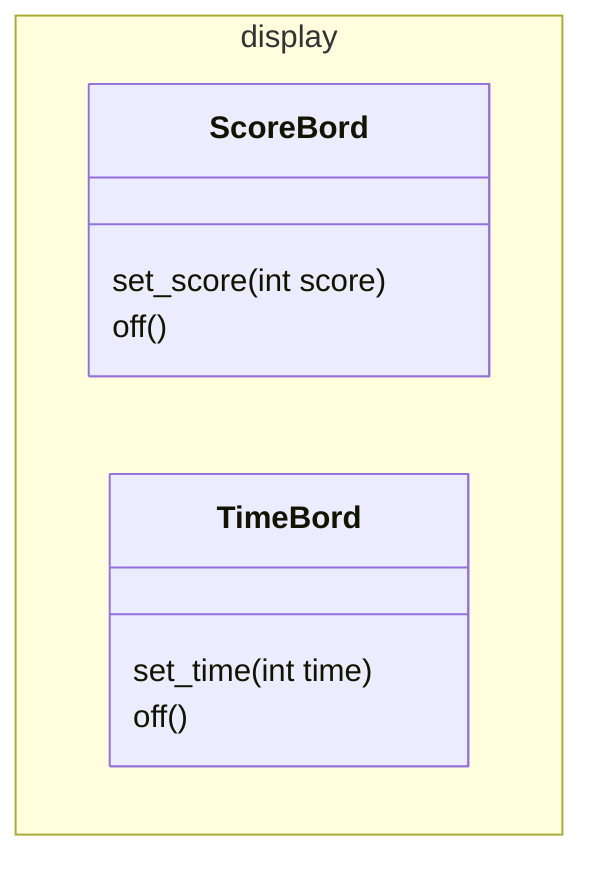
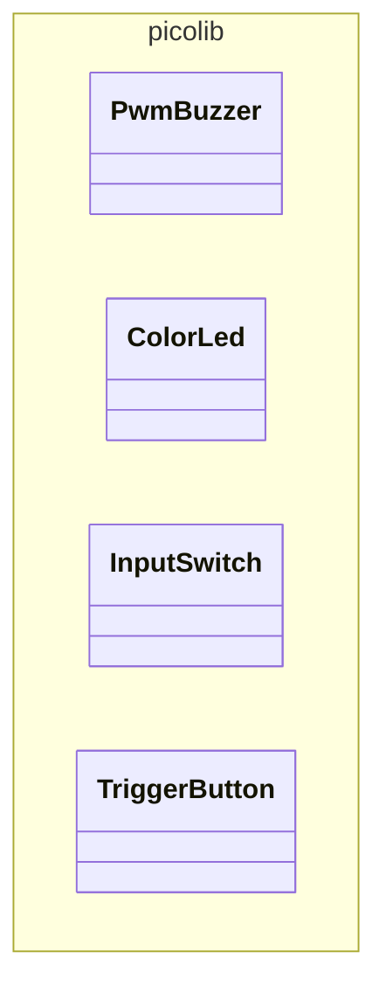

# プログラム設計

## クラス図

---

### color_matching_game

#### 定数

```mermaid
classDiagram
namespace game_const {
    class GameMode {
        int EASY
        int NORMAL
        int HARD
        int EXPERT
    }

    class LightLevel{
        int OFF
        int POOR
        int LOW
        int MIDDLE
        int HIGH
        int MAX
    }

    class LightValue{
        get_val(int light_level) int
    }

    class VolumeSeparatValue{
        int POOR
        int LOW
        int MIDDLE
        int HIGH
        int MAX
    }
}
```

#### 色レベル変換

```mermaid
classDiagram
namespace color_level_converter {
    class ColorLevelConvertor{
        et_colr_level(int volume_u16) int
    }

    class ColorLevelConvertorForEasy{}

    class ColorLevelConvertorForNormal{}

    class ColorLevelConvertorForHard{}
}
ColorLevelConvertor <-- ColorLevelConvertorForEasy
ColorLevelConvertor <-- ColorLevelConvertorForNormal
ColorLevelConvertor <-- ColorLevelConvertorForHard
```

#### 出題

```mermaid
classDiagram
namespace question_generator {
    class QuestionGenerator{
        get_question_rgb_level() list[int]
        __get_random_rgb_level() list[int]
    }

    class QuestionGeneratorForEasy{}

    class QuestionGeneratorForNormal{}

    class QuestionGeneratorForHard{}
}
QuestionGenerator <-- QuestionGeneratorForEasy
QuestionGenerator <-- QuestionGeneratorForNormal
QuestionGenerator <-- QuestionGeneratorForHard
```

#### ヒント

```mermaid
classDiagram
namespace hint_generator {
    class HintGenerator {
        get_hint(int r, int g, int b)
    }

    class HintGeneratorForEasy {}

    class HintGeneratorForNormal {}

    class HintGeneratorForHard {}
}
HintGenerator <-- HintGeneratorForEasy
HintGenerator <-- HintGeneratorForNormal
HintGenerator <-- HintGeneratorForHard
```

#### 表示

```mermaid
classDiagram
namespace display {
    class ScoreBord {
        set_score(int score)
        off()
    }

    class TimeBord {
        set_time(int time)
        off()
    }
}
```

### picolib

※各クラスの詳細はpicolibを参照

```mermaid
classDiagram

namespace picolib {
    class PwmBuzzer{}
    class ColorLed{}
    class InputSwitch{}
    class TriggerButton{}
}

```
