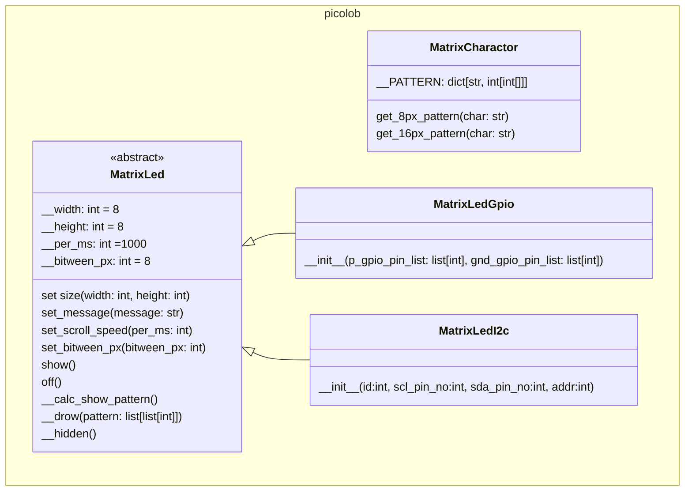

# マトリクスLEDで文字表示

## 概要

マトリクスLEDで文字を表示する。
対応する文字種は以下とする。

* アルファベット(大文字、小文字)
* 数字
* 一部の記号
* ひらがな
* カタカナ
* 一部の漢字

※ 解像度が低いため、つぶれてしまう文字は対象外とする

### 特記事項

初版は8x8のマトリクスLED専用として開発する。
今後、横幅の大きい(16x8)ものや、サイズの大きい(16x16や32x16)ものに対応する。
ただし、高さは8か16の二種類のみとする。

## 文字情報

int[8]で定義する。
0b01234567 で縦方向8bitを定義し、列単位で配列の要素とする。

※補足
単色（onかoff）なため、8*8の二次元配列とはしない。
スクロール処理ロジックを考慮すると列単位の配列の方が扱いやすい。
（[3]～[7]を表示、のようにできる）

※課題
コード上で文字が読みにくい。

```python
__B = [
    0b00000000,
    0b00000000,
    0b01101110,
    0b10010001,
    0b10010001,
    0b11111111,
    0b00000000,
    0b00000000
]
```

int[8]で定義する。
0b01234567 で縦方向8bitを定義し、行単位で配列の要素とする。

```python
__B = [
    0b00111000,
    0b00100100,
    0b00100100,
    0b00111000,
    0b00100100,
    0b00100100,
    0b00100100,
    0b00111000
]
```

※補足
単色（onかoff）なため、8*8の二次元配列とはしない。
スクロールする場合、ビットシフトで表示範囲のみを取り出す。

```python
show_pattern = [
    0b11100000,
    0b10010000,
    0b10010000,
    0b11100000,
    0b10010000,
    0b10010000,
    0b10010000,
    0b11100000
]
```

## 文字列のスクロール方法

### 初期化

1. 文字数*8で表示幅ドット数を求める
2. 文字ごとに定義されたint[8]を取得し、配列に追加する
   （[int[8]]となる）

### スクロール処理

1. 現在の表示開始位置を取得
   （表示開始位置は0～初期化時に求めた表示ドット数-1）
2. 表示開始位置を8で割ったint値を求め、左側の文字位置を取得する
3. 表示開始位置を8で割った余りを求め、左側の文字のずれ量を取得する
   （2^nの余はビットシフトによる高速計算があるらしい）
4. 左側の文字のint[8]の各値をずれ量だけ左にbitシフトした値を生成する。
5. 右側の文字のint[8]の各値をずれ量だけ右にbitシフトした値を生成する。
6. 3と4で生成した値のorを取得する。（無駄に配列を作らないような考慮が必要）
7. 生成した値でマトリクスLEDの点灯消灯を行う。
8. 現在の表示開始位置を1進める。

例：
「BB」が左に流れていく途中、両方の文字の中間を表示する場合、
前側の文字は左4bitシフト、右側の文字は右4bitシフトとし、orをとる。
（シフトすることで作られる新しいbitが0となるため、この方法が成立する。）

```python
show_pattern = [
    0b10000011,
    0b01000010,
    0b01000010,
    0b10000011,
    0b01000010,
    0b01000010,
    0b01000010,
    0b10000011
]
```

## クラス図



### 実装規約

__drowと__hiddenを子クラスで実装する。
（GPIO直接制御とI2C制御では出力方式が異なるため、共通化ができない）
__drowは引数に渡された値でマトリクスLEDの点灯消灯を行うように実装する。
__hiddenはすべて消灯を行うように実装する。

showでスレッドを生成してループ処理を開始する。
offでスレッドを停止し、すべて消灯する。
ループ処理内での__drow呼び出しは同期処理で実行する。
ループ処理を抜けた後に__hiddenが呼ばれる。
子クラスで新しいスレッドを生成して描画しないこと。
（showとoffの実行と実際の表示がずれてしまう）
