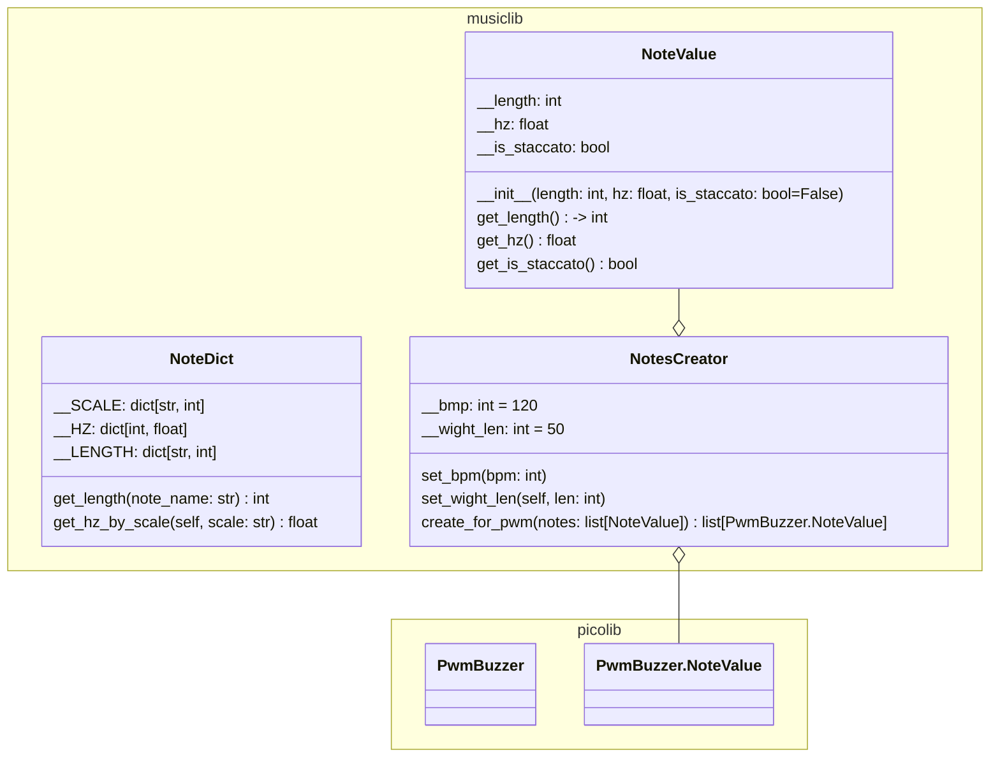

# 楽曲配列作成パッケージ

## 概要

音符の長さや音階の周波数を定義したクラスを持つ。
その定義を元に、各音源で再生するためのデータを作成する。

初版ではPwmBuzzerクラスのplay_musicに渡す配列を作成する。

### play_muaicの引数

PwmBuzzer.Noteの配列を渡す。
Noteは音の長さ(ミリ秒)、周波数(hZ)、後ろの余白長さ(ミリ秒、デフォルト10)の値を持つ。

### 周波数定義

NoteDictクラスの__SCALEにA0～C8までのキー、__HZに周波数(hZ)を定義済み。

### 制限事項

PwmBuzzerは圧電ブザー制御なため1音のみしか再生できない。

//TODO 和音対応版を今後作成するかもしれないが、そこまでやるなら別の音源を使った方が楽…

---

## 楽曲作成パッケージのクラス仕様

※picolib内のクラスは[picolibの仕様書](../picolib/README.md)を参照。

---

### 入力データ

**// TODO** SMF(標準MIDI)を読み込んで変換できるようにしたい…

#### BPM

1分当たりの4分音符数をintで指定する。（楽譜のbpm記載と同じ）

#### 音階

文字列キーで音階を指定する。
NoteDict.__SCALEに記載がないキーの指定は不可能。
変音は#しか定義していない点に注意。

※B♭はA#を使う、というように置き換えて入力する

#### 音の長さ

文字列キーで指定する。
NoteDict.__LENGTHに記載がない長さの指定は不可能。

#### 音符に関する制限事項

スタッカートはフラグで指定し、鳴らす長さは固定。
スラーは未対応（音間の隙間は固定）。

#### ※補足

楽譜を読むときは4/4の楽譜ならどう書かれるかとして考えること。
3/4、6/8、8/8などの他のパターンは暗算して対応する。

どの音を何ミリ秒鳴らす（鳴らさない）かの値のみ持つ配列を生成するため、
データ作成で困ることはないと思われる。

---

[戻る](../library.md)
