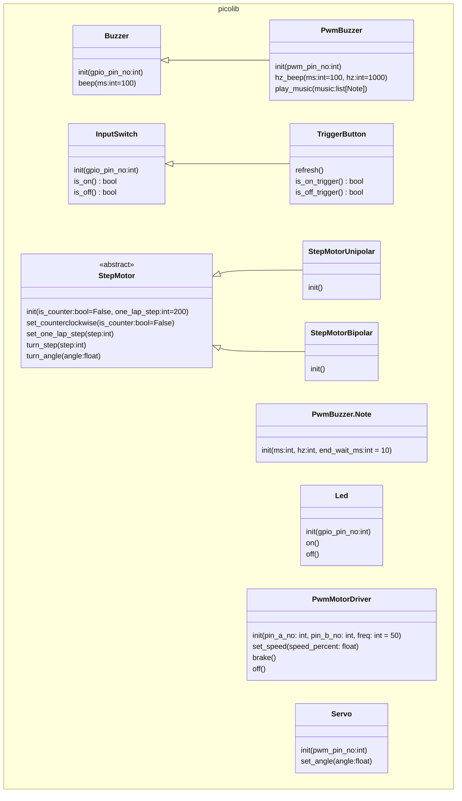

# Pico用基礎クラスパッケージ

## 概要

電子パーツ用クラスを作成し、今後の作品で再利用できるようにする。

## 運用方針

各作品でクラスを利用する場合は必要なモノを各プロジェクトにコピーして使う。
\_\_init\_\_.pyのみ、各プロジェクト側で作成してコミットする。
クラスの追加や修正はこのパッケージへマージする。

## クラス一覧

### Buzzer

ブザー。
指定したミリ秒数鳴らすことができる。

### PwmBuzzer

Pmw制御ブザー。
Buzzerの子クラス。
指定したミリ秒、指定した周波数を鳴らすことができる。

### InputSwitch

入力スイッチ。
onかoffかを取得できる。

### TriggerButton

トリガー検知対応ボタン。
InputSwitchの子クラス。
reflechでトリガーを更新し、onトリガーとoffトリガーを取得できる。

### Led

発光ダイオード。
点灯(on)と消灯(off)ができる。

### PwmMotorDriver

モータードライバにPWM信号を送信してDCモーターを制御する。
制御ピン2本の電位差で速度が変更できるモータードライバに対応する。
※PWMの周波数で電圧を疑似的に変化させている
正転と逆転が期待と異なる場合は配線を逆にして対応すること。

### Servo

Pwm制御のサーボ。
角度を°で指定できる。

### StepMotor

ステッピングモーター。
指定ステップ数回転、指定角度回転ができる。
指定角度回転のためには1周に必要なステップの設定が必要。
マイナス値で反時計回りの想定だが、逆回転するモーターの場合はset_counterclockwise(True)で逆回転モーターであることを指定する。

### StepMotorUnipolar

ユニポーラ制御ステッピングモーター。
StepMotorの子クラス。

### StepMotorBipolar

バイポーラ制御ステッピングモーター。
StepMotorの子クラス。

---

[戻る](../library.md)