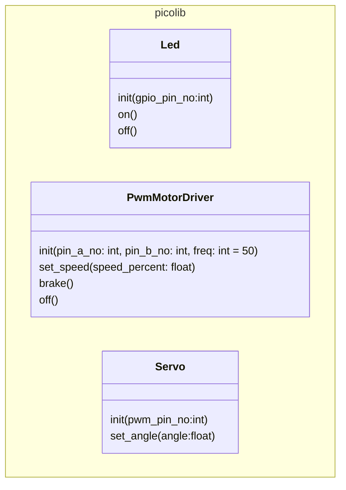
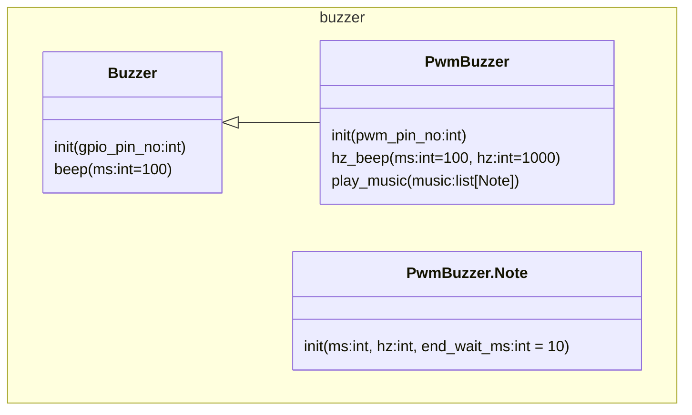
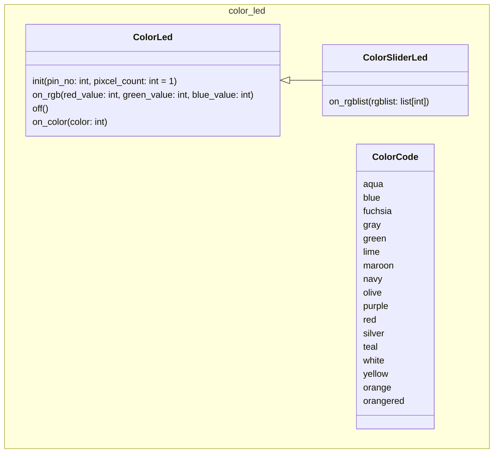
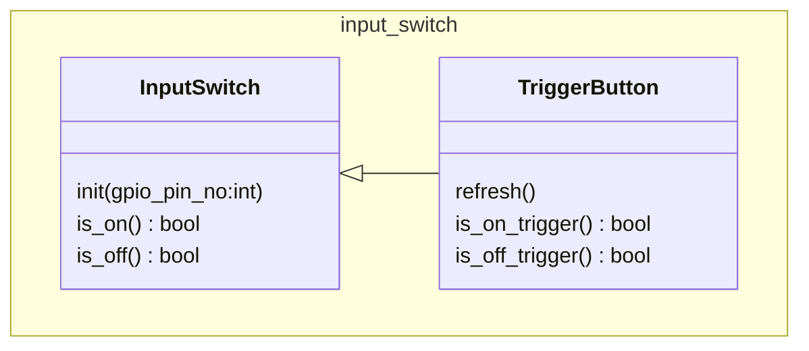
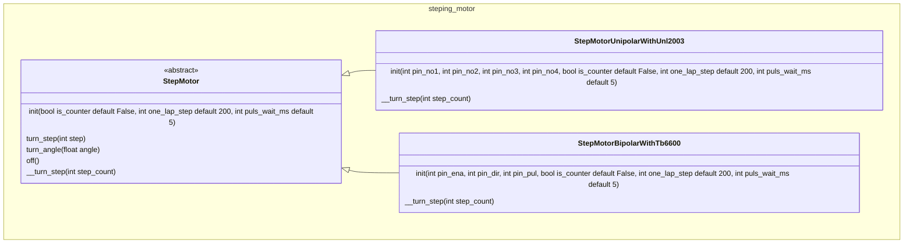

# Pico用基礎クラスパッケージ

## 概要

電子パーツ用クラスを作成し、今後の作品で再利用できるようにする。

## 運用方針

各作品でクラスを利用する場合は必要なモノを各プロジェクトにコピーして使う。
\_\_init\_\_.pyのみ、各プロジェクト側で作成してコミットする。
クラスの追加や修正はこのパッケージへマージする。

---

## パッケージ内クラス一覧

### 一般部品

```mermaid
classDiagram
namespace picolib {
    class Led{
        init(gpio_pin_no:int)
        on()
        off()
    }

    class PwmMotorDriver{
        init(pin_a_no: int, pin_b_no: int, freq: int = 50)
        set_speed(speed_percent: float)
        brake()
        off()
    }

    class Servo{
        init(pwm_pin_no:int)
        set_angle(angle:float)
    }
}
```

#### Led

発光ダイオード。
点灯(on)と消灯(off)ができる。

#### PwmMotorDriver

モータードライバにPWM信号を送信してDCモーターを制御する。
制御ピン2本の電位差で速度が変更できるモータードライバに対応する。
※PWMの周波数で電圧を疑似的に変化させている
正転と逆転が期待と異なる場合は配線を逆にして対応すること。

#### Servo

Pwm制御のサーボ。
角度を°で指定できる。

---

### ブザー

```mermaid
classDiagram
namespace buzzer {
    class Buzzer{
        init(gpio_pin_no:int)
        beep(ms:int=100)
    }

    class PwmBuzzer{
        init(pwm_pin_no:int)
        hz_beep(ms:int=100, hz:int=1000)
        play_music(music:list[Note])
    }

    class PwmBuzzer.Note {
        init(ms:int, hz:int, end_wait_ms:int = 10)
    }
}
Buzzer <|-- PwmBuzzer
```

#### Buzzer

  ブザー。  
  指定したミリ秒数鳴らすことができる。

#### PwmBuzzer

Pmw制御ブザー。Buzzerの子クラス。  
指定したミリ秒、指定した周波数を鳴らすことができる。

---

### フルーカラーLED

```mermaid
classDiagram
namespace color_led {
    class ColorLed{
        init(pin_no: int, pixcel_count: int = 1)
        on_rgb(red_value: int, green_value: int, blue_value: int)
        off()
        on_color(color: int)
    }

    class ColorCode{
        aqua
        blue
        fuchsia
        gray
        green
        lime
        maroon
        navy
        olive
        purple
        red
        silver
        teal
        white
        yellow
        orange
        orangered
    }

    class ColorSliderLed{
        on_rgblist(rgblist: list[int])
    }
}
ColorLed <|-- ColorSliderLed
```

---

### 入力スイッチ

```mermaid
classDiagram
namespace input_switch {
    class InputSwitch{
        init(gpio_pin_no:int)
        is_on() bool
        is_off() bool
    }
    class TriggerButton{
        refresh()
        is_on_trigger() bool
        is_off_trigger() bool
    }
}
InputSwitch <|-- TriggerButton
```

#### InputSwitch

入力スイッチ。  
onかoffかを取得できる。

#### TriggerButton

トリガー検知対応ボタン。InputSwitchの子クラス。  
reflechでトリガーを更新し、onトリガーとoffトリガーを取得できる。

---

### ステッピングモーター

```mermaid
classDiagram
namespace steping_motor {
    class StepMotor{
        <<abstract>>
        init(bool is_counter default False, int one_lap_step default 200, int puls_wait_ms default 5)
        turn_step(int step)
        turn_angle(float angle)
        off()
        __turn_step(int step_count)
    }

    class StepMotorUnipolarWithUnl2003 {
        init(int pin_no1, int pin_no2, int pin_no3, int pin_no4, bool is_counter default False, int one_lap_step default 200, int puls_wait_ms default 5)
        __turn_step(int step_count)
    }

    class StepMotorBipolarWithTb6600 {
        init(int pin_ena, int pin_dir, int pin_pul, bool is_counter default False, int one_lap_step default 200, int puls_wait_ms default 5)
        __turn_step(int step_count)
    }
}
StepMotor <|-- StepMotorUnipolarWithUnl2003
StepMotor <|-- StepMotorBipolarWithTb6600
```

#### StepMotor

ステッピングモータークラス。
指定ステップ数回転、指定角度回転ができる。
指定角度回転のためには1周に必要なステップの設定が必要。
マイナス値で反時計回りの想定だが、逆回転するモーターの場合はset_counterclockwise(True)で逆回転モーターであることを指定する。

#### StepMotorUnipolarWithUnl2003

UNL2003ドライバによるユニポーラステッピングモーター制御クラス。
StepMotorの子クラス。

#### StepMotorBipolarWithTb6600

TB6600ドライバによるバイポーラステッピングモーター制御クラス。
StepMotorの子クラス。

---

[戻る](../library.md)