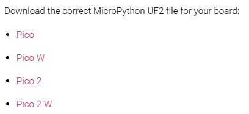

# picoガイド

---

## 目次

* プログラムセットアップ編
  * ファームの準備
  * Thonnyの準備
  * プログラムの投入
* 上手くいかない時
* よくあるプログラム

---

## プログラムセットアップ編

### ファームの準備

1. picoのbootselボタンを押しながらUSBケーブルを接続
   
   ドライブとして表示されればOK
2. pico公式サイトからmicropython用ファームウェアをダウンロード
   https://www.raspberrypi.com/documentation/microcontrollers/micropython.html
   
3. ダウンロードしたファームウェアをpicoにコピー
   ファイルが転送されるとpicoのドライブとしての接続が切れます

### Thonnyの準備

公式サイトから取ってきます。
https://thonny.org/

### プログラムの投入

Thonnyでpicoに保存します。
電源投入時に実行したいものは「main.py」とする必要があります。
何かを参考して作ったプログラムの場合、importのための追加ファイルが必要な場合があります。

---

## 上手くいかない時

* bootselボタンを押してないのにファイルが表示される
  ファームウェアが入ってません。ファームウェアの準備をもう一度やりましょう。
* bootselボタンを押しているのにファイルが表示されない
  USB端子がだめになっているか、picoが壊れているかもしれません。
* Thonnyにpicoが表示されない
  
  * すでにmain.pyが入っている場合、プログラムが実行中です。
    Thonnyの停止ボタンを押してください。
    
  * 接続先が違います。
    honny右下の接続先設定でpicoを選択してください。
    
  * Thonnyを複数起動していませんか？
    他が世知族中の場合は接続を拒否されてしまいます。
* Thonnyの接続先でpicoが選べない
  ファームウェアが正しくない可能性があります。
* プログラムが更新されない
  プログラムを停止してから上書き保存して再実行しましょう。
  main.py以外のファイルを修正した場合、picoに入っているのが最新になってません。
  PC側のファイルを修正して動作確認した場合、picoへの上書き保存を忘れずに実行してください。

---

### よくあるプログラムエラー

* not defined
  おそらく誤植です。
  存在しない関数名や変数名を書いてます。
  もしくは、importが正しくされていません。
* syntax error
  主に誤植です。
  ifやforのコロン(:)忘れが無いかも確認してください。
* Error 5 EIO
  配線ミスかもしれません。
  picoで5V用の部品を直結した場合にも発生します。
