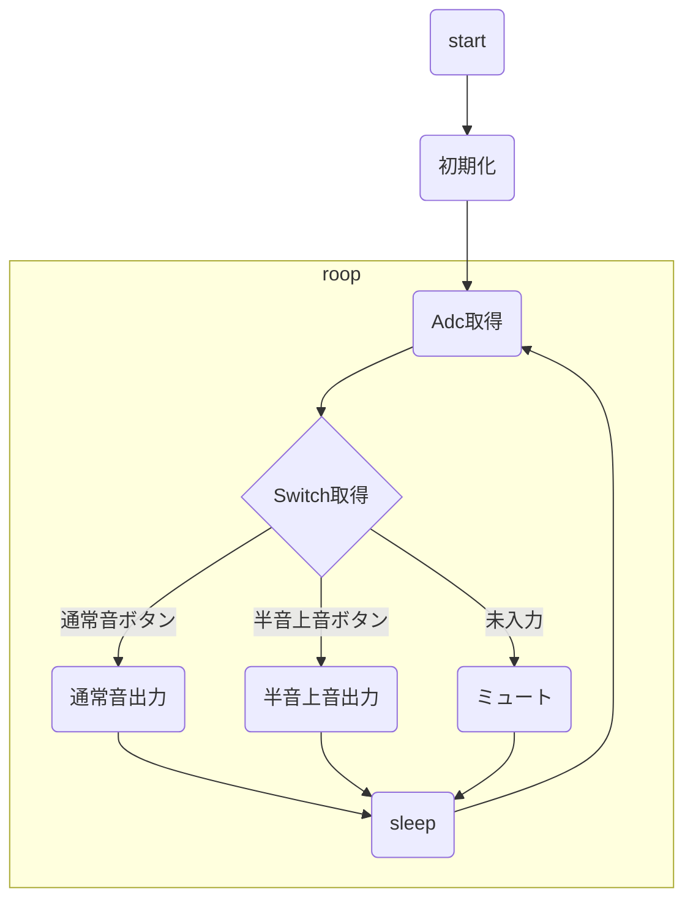

# PmwBuzzerを使った楽器

## 概要

pwmブザーで楽器を作る。
一音のみなため、和音が出せる入力系は使えない。
笛の類とすると衛生的に問題が出る。

## 音域案

最低音周波数＋最低音周波数×7×アナログ入力の％とする。
最低が440Hzの場合は最大3520Hzの3オクターブ幅になる

## 入出力

|ピン番号|種類|用途|
|--|--|--|
|0|GPIO IN|通常音ボタン|
|1|GPIO IN|半音上音ボタン|
|2|PWM|圧電サウンダ出力|
|28|ADC|音程調整|

## 使用ライブラリ

### picolib

- InputAdc
- InputSwitch
- PwmBuzzer

## プログラム

無限ループの処理とする。
回路上に電源スイッチを設けるため、プログラム上で終了の考慮は不要。
通常音ボタンと半音上音ボタンの同時押しは出来ない構造なため、優先度の考慮不要。

## 今後の拡張性

ボタンを押したら曲を流す機能の追加
musiclibを利用して曲データを打ち込む。
