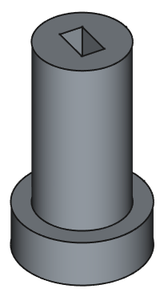
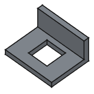

# 反応速度を測るゲーム3Dプリン部品リスト

## フォルダ

/ReflexesGame/cad

## 部品一覧

※注意　部品ごとに画像の拡大率が異なる

---

### 外装

|No|ファイル名|使用数|用途|備考|
|--|---------|-----|----|----|
|01|ButtonSleeve.FCStd|12|ターゲットボタン用スリープ|板の両面に使用|
|02|LedSleeve.FCStd|6|ボタンに対応するLEDの保持||
|03|BackPanelSpacer.FCStd|4|背面板取り付け調整用スペーサー||
|04|LedSleeveHolder.FCStd|6|LedSleeveの配線固定キャップ||
|05|LedBinder.FCStd|6|LedSleeveの抜け防止|LedSleeveHolderと板の間に挟む|
|06|SidWalHolder.FCStd|8|側面パネル固定||
|07|SupportPiller.FCStd|10|背面版との隙間埋め||
|08|SwitchHoldPiller.FCStd|1|電源スイッチ支持柱||
|09|SwitchHoldPillerBinder.FCStd|1|電源スイッチ支持柱の抜け防止||
|10|PwerSwitchShaft.FCStd|1|電源スイッチ||
|11|EneSwitchPanelFace.FCStd|1|電源、リセット、モード切替スイッチカバー固定枠|表側から差し込む|
|12|EneSwitchPanelSleeve.FCStd|1|電源、リセット、モード切替スイッチカバー|裏側から差し込む|
|13|EneSwitchPanelBack.FCStd|1|電源、リセット、モード切替スイッチ保持|裏側から差し込む|
|14|ResetButtonHolder.FCStd|1|リセットボタン固定|EneSwitchPanelBackにネジ止め|

|01|02|03|04|05|06|07|08|09|10|11|12|13|14|
|--|--|--|--|--|--|--|--|--|--|--|--|--|--|
|||||||||||||||

---

### PGボード

|分類|No|ファイル名|使用数|用途|備考|
|----|--|---------|-----|----|----|
|01|PgBordSpacer.FCStd|4|基盤を浮かせるためのスペーサー||
|02|ConnectorSupport4.FCStd|1|4本コネクタ支持||
|03|ConnectorSupport8.FCStd|1|8本コネクタ支持|他コネクタ回避用切り欠き有り|
|04|EleBordJoint.FCStd|1|汎用基盤接続用プレート||
|05|EleBordJointConnecter.FCStd|2|汎用基盤接続用プレートと基盤とのねじ止め||
|06|EneInputSupport.FCStd|2|電源ボード入力ピン支持||
|07|PgBordHolder.FCStd|2|基盤固定用を本体に固定|電源の反対側に使用|
|08|PgBordHolderSub.FCStd|2|基盤固定用を本体に固定|電源側に使用|

|01|02|03|04|05|06|07|08|
|--|--|--|--|--|--|--|--|
|||||||||

---

### スコアボード

|No|ファイル名|使用数|用途|備考|
|--|---------|-----|----|----|
|01|DisplayWireHolderRing.FCStd|1|スコアボード抜け止めリング|表板の裏側に使用|
|02|InnerSleeveExtender.FCStd|1|スコアボード配線パイプ延長||
|03|LedCover.FCStd|2|結果表示ランプカバー||
|04|LedRefractor.FCStd|2|結果表示ランプ背面反射材用パネル|長い方が内側|
|05|LedSclean.FCStd|2|結果表示ランプ全面パネル|LedCoverとのはめ込みがない側が外側|
|06|ScoreBordBase.FCStd|1|スコアボード基礎|貫通リング含む|
|07|ScoreBordBaseSupport.FCStd|1|スコアボード用基盤固定||
|08|ScoreBordFace.FCStd|1|スコアボード表面パネル||
|09|ScoreBordFrontSpacer.FCStd|1|スコアボード用各部品浮き防止|※左右反転で印刷|
|10|ScoreBordHolder.FCStd|1|スコアボード用各部品位置合わせ||
|11|ScoreBordSideHolder.FCStd|1|スコアボード回転防止||
|12|ScoreBordWoal.FCStd|1|スコアボード側壁||
|13|ScoreDisplaySpacer.FCStd|1|7セグディスプレイ浮き防止||
|14|StartSwitchHolder.FCStd|1|スタートスイッチ浮き防止||
|15|StartSwitchHoldPin.FCStd|1|スタートスイッチの固定ピン|スコアボード側壁に打ち込む|

|01|02|03|04|05|06|07|08|09|10|11|12|13|14|15|
|--|--|--|--|--|--|--|--|--|--|--|--|--|--|--|
||||||||||||||||

---

### 電池

|No|ファイル名|使用数|用途|備考|
|--|---------|-----|----|----|
|01|BatteryHolder.FCStd|2|電池ボックスの両脇保持|※片方は左右反転して印刷|
|02|BatteryHolderBridge.FCStd|1|BatteryHolderの左右連結||
|03|BatteryHolderBridgeBainder.FCStd|1|atteryHolderBridgeに差し込んで固定|基盤を支えるプレートの向きに注意|
|04|BatteryPanelOpenerFrame.FCStd|2|電池ボックス開閉蓋の左右枠|※片方は左右反転して印刷|
|05|BatteryPanelOpenerUpperFrame.FCStd|1|電池ボックス開閉蓋の上枠||
|06|BatteryPanelOpenerLowwerFrame.FCStd|1|電池ボックス開閉蓋の下枠||
|07|BatteryHolderHood.FCStd|1|電池ボックス開閉蓋|凹みがある方が内側|

|01|02|03|04|05|06|07|
|--|--|--|--|--|--|--|
||||||||
