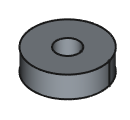
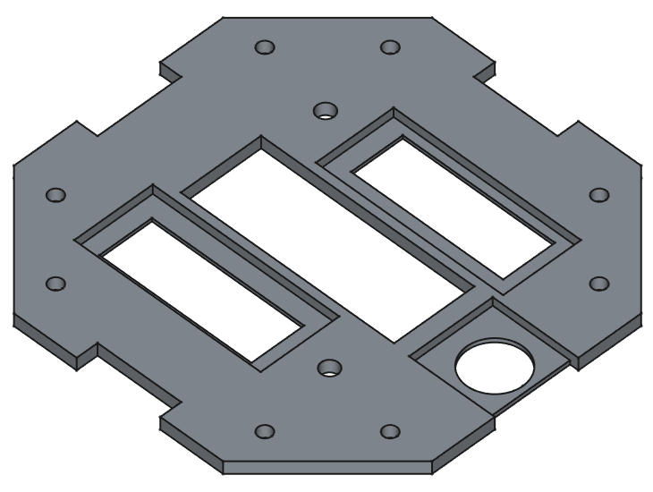

# 反応速度を測るゲーム3Dプリン部品リスト

## フォルダ

/ReflexesGame/cad

## 部品一覧

|No|ファイル名|使用数|用途|備考|
|--|---------|-----|----|----|
|01|BackPanelSpacer.FCStd|4|背面板取り付け調整用スペーサー||
|02|ButtonSleeve.FCStd|12|ターゲットボタン用スリープ|板の両面に使用|
|03|ConnectorSupport4.FCStd|1|4本コネクタ支持||
|04|ConnectorSupport8.FCStd|1|8本コネクタ支持|他コネクタ回避用切り欠き有り|
|05|DisplayWireHolderRing.FCStd|1|スコアボード抜け止めリング|表板の裏側に使用|
|06|EleBordJoint.FCStd|1|汎用基盤接続用プレート||
|07|EleBordJointConnecter.FCStd|2|汎用基盤接続用プレートと基盤とのねじ止め||
|08|EneInputSupport.FCStd|2|電源ボード入力ピン支持||
|09|InnerSleeveExtender.FCStd|1|スコアボード配線パイプ延長||
|10|LedCover.FCStd|2|結果表示ランプカバー||
|11|LedRefractor.FCStd|2|結果表示ランプ背面反射材用パネル|長い方が内側|
|12|LedSclean.FCStd|2|結果表示ランプ全面パネル|LedCoverとのはめ込みがない側が外側|
|13|LedSleeve.FCStd|6|ボタンに対応するLEDの保持||
|14|PgBordHolder.FCStd|2|基盤固定用を本体に固定|電源の反対側に使用|
|15|PgBordHolderSub.FCStd|2|基盤固定用を本体に固定|電源側に使用|
|16|PgBordSpacer.FCStd|4|基盤を浮かせるためのスペーサー||
|17|ScoreBordBase.FCStd|1|スコアボード基礎|貫通リング含む|
|18|ScoreBordBaseSupport.FCStd|1|スコアボード用基盤固定||
|19|ScoreBordFace.FCStd|1|スコアボード表面パネル||
|20|ScoreBordFrontSpacer.FCStd|1|スコアボード用各部品浮き防止|※左右反転で印刷|
|21|ScoreBordHolder.FCStd|1|スコアボード用各部品位置合わせ||
|22|ScoreBordSideHolder.FCStd|1|スコアボード回転防止||
|23|ScoreBordWoal.FCStd|1|スコアボード側壁||
|24|ScoreDisplaySpacer.FCStd|1|7セグディスプレイ浮き防止||
|25|StartSwitchHolder.FCStd|1|スタートスイッチ浮き防止||
|26|StartSwitchHoldPin.FCStd|1|スタートスイッチの固定ピン|スコアボード側壁に打ち込む|

## 部品画像

※注意　部品ごとに拡大率が異なる

|No|画像|
|--|----|
|01||
|02||
|03||
|04||
|05||
|06||
|07||
|08||
|09||
|10||
|11||
|12||
|13||
|14||
|15||
|16||
|17||
|18||
|19||
|20||
|21||
|22||
|23||
|24||
|25||
|26||
