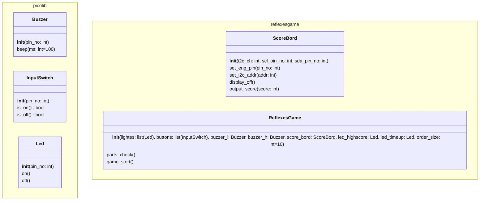

# 反応速度を測るゲームのプログラム

## クラス図

```mermaid
classDiagram

namespace picolib {

    class Buzzer {
        __init__(pin_no: int)
        beep(ms: int=100)
    }

    class InputSwitch{
        __init__(pin_no: int)
        is_on()  bool
        is_off()  bool
    }

    class Led{
        __init__(pin_no: int)
        on()
        off()
    }
}

namespace reflexesgame {
    class ScoreBord{
        __init__(i2c_ch: int, scl_pin_no: int, sda_pin_no: int)
        set_eng_pin(pin_no: int) 
        set_i2c_addr(addr: int)
        display_off()
        output_score(score: int)
    }

    class ReflexesGame{
        __init__(lightes: list(Led), buttons: list(InputSwitch), buzzer_l: Buzzer, buzzer_h: Buzzer, score_bord: ScoreBord, led_highscore: Led, led_timeup: Led, order_size: int=10)
        parts_check()
        game_stert()
    }
}

```

## 概要

ReflexesGameをインスタンス化し、game_startでゲーム開始。
カウンタのk開始は9999固定。

order_size指定でゲームの難易度(時間内に押すボタンの数)を変更したい場合はインスタンスの再生成が必要。
呼び出し元のメイン処理で必要な実装を行うこと。